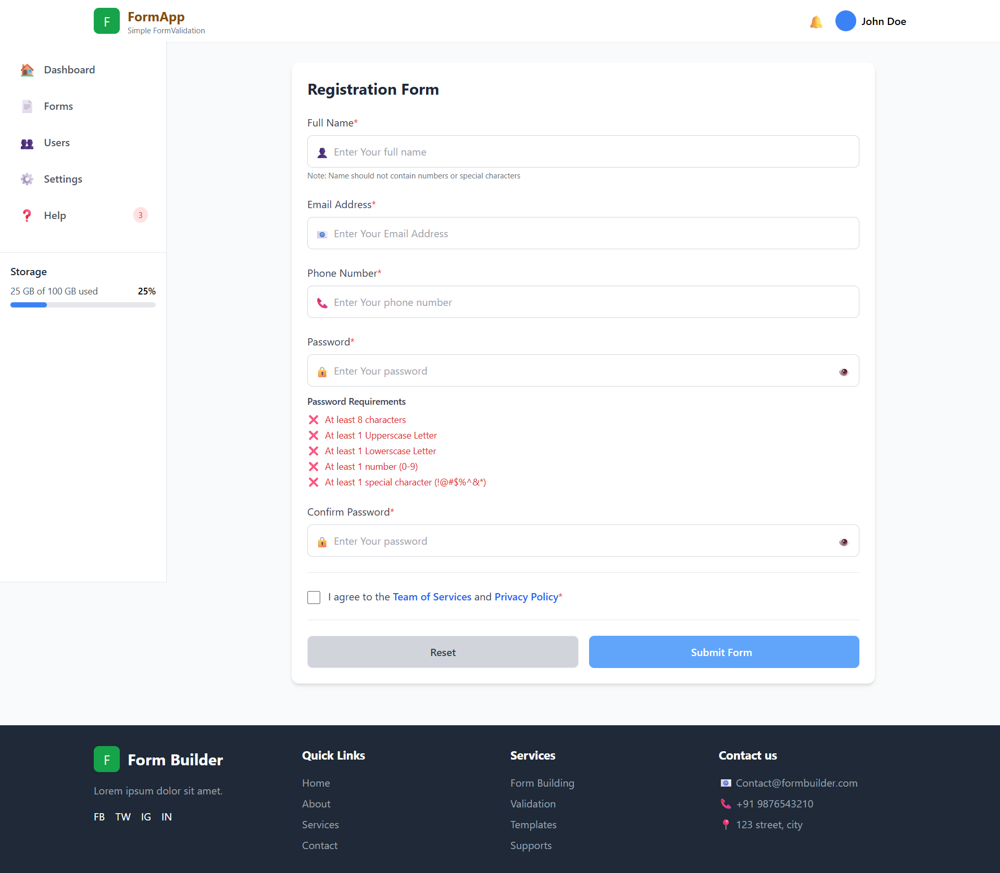

# ✅ React Form Validation

A modern and responsive **Form Validation application** built with **React.js** and **Vite**.

The application provides a user-friendly registration form with real-time validation for name, email, phone number, password, confirm password, and terms & conditions.

It also includes **Password Strength Validation**, **Show/Hide Password**, **Error Messages**, **Form Reset**, **Submission Feedback**, and a clean responsive UI.

---

## 🌐 Live Demo

🔗 **[View Live Demo](https://react-form-validation-project-wheat.vercel.app/)**

> Replace `YOUR_VERCEL_LINK` with your deployed Vercel URL.

---

## 📸 Preview



---

## ✨ Features

- 👤 Full Name validation
- 📧 Email Address validation
- 📱 Phone Number validation
- 🔐 Password validation
- 💪 Password strength checking
- 🔄 Confirm Password validation
- 👁️ Show/Hide Password
- ☑️ Terms & Conditions validation
- ❌ Real-time error messages
- 🔴 Invalid input highlighting
- 🔄 Reset form functionality
- ✅ Successful submission message
- ⏳ Form submission loading state
- 📱 Responsive user interface
- 🎨 Modern and clean UI
- ⚡ Fast development with Vite

---

## 🔐 Password Validation

The password must satisfy the following requirements:

- ✅ At least 8 characters
- ✅ At least 1 uppercase letter
- ✅ At least 1 lowercase letter
- ✅ At least 1 number
- ✅ At least 1 special character

The validation status is displayed dynamically while the user enters the password.

---

## 🛠️ Technologies Used

### Frontend

- **React.js**
- **JavaScript (ES6+)**
- **Tailwind CSS**
- **React Hooks**

### Development Tools

- **Vite**
- **Git**
- **GitHub**
- **VS Code**

---

## 📂 Project Structure

```text
react-form-validation/

│
├── public/
│
├── src/
│   ├── assets/
│   │   └── form-validation-preview.png
│   │
│   ├── components/
│   │   ├── FormValidation.jsx
│   │   ├── Footer.jsx
│   │   └── Sidebar.jsx
│   │
│   ├── App.jsx
│   ├── App.css
│   ├── index.css
│   └── main.jsx
│
├── .gitignore
├── eslint.config.js
├── index.html
├── package.json
├── package-lock.json
├── postcss.config.js
├── tailwind.config.js
├── vite.config.js
└── README.md
